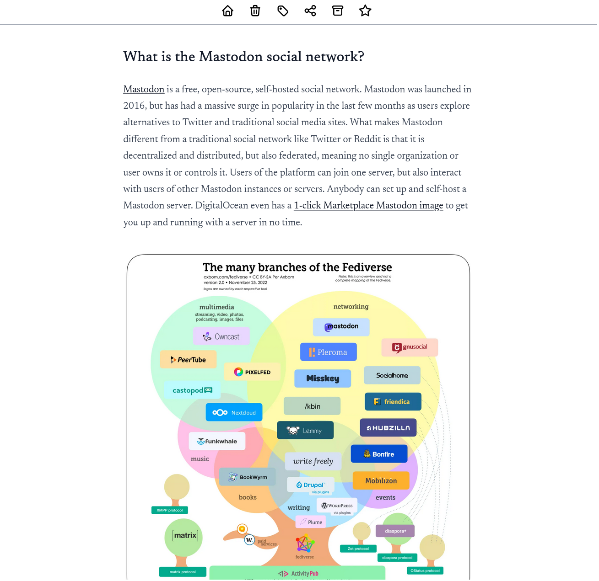

# Manucure: A Self-Hosted Alternative to Pocket

Welcome to the Manucure repository! Manucure is a free and open-source web application written in Rust that provides a self-hosted alternative to the popular bookmarking service, Pocket. With Manucure, you can save and organize your favorite web pages for later reading, all from the comfort of your own server.

## Features

- Save and organize web pages for later reading
- Search and filter your saved pages
- Tag your saved pages for better organization
- Import and export your saved pages
- Access your saved pages from anywhere with an internet connection
- Supports OpenID Connect authentication using providers such as Keycloak

## Getting Started

To get started with Manucure, you can either set up a server to host the application or use the provided Docker image.

Before you start, you will need to set up an OpenID Connect authentication provider, such as Keycloak, and obtain the necessary configuration information, including the client ID, client secret, and authentication endpoint.

### Option 1: Setting up a server

The following steps will guide you through the process of setting up a server to host Manucure:

1. Install the required dependencies, including a web server (e.g. Apache or Nginx), PHP, and a database (e.g. MySQL or PostgreSQL).
2. Download the latest release of Manucure from this repository and extract it to your server.
3. Set up a virtual host for Manucure and configure your web server to serve the application.
4. Create a database and run the SQL scripts included in the repository to set up the necessary tables.
5. Update the configuration file with your database information, OpenID Connect provider information, and other settings.
6. Access the Manucure application in your web browser and log in using your OpenID Connect provider.

### Option 2: Using the Docker Image

If you prefer to use a Docker image, you can use the following steps:

1. Install Docker on your machine.
2. Pull the latest Manucure Docker image from [Docker Hub](https://hub.docker.com).
3. Start a Docker container using the image and specify the necessary environment variables, including the OpenID Connect provider information, and ports.
4. Access the Manucure application in your web browser using the IP address and port of the Docker container, and log in using your OpenID Connect provider.

## Screenshots

## Contributing

If you would like to contribute to the development of Manucure, we welcome your contributions! Please feel free to submit a pull request or open an issue in this repository if you have any suggestions or
